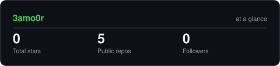
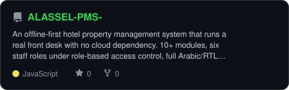
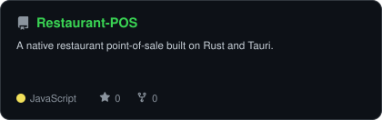
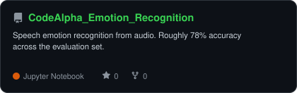
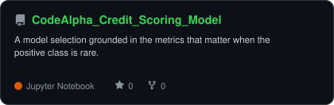

<div align="center">

<!-- PORTRAIT - generated by scripts/dotify.py from assets/me-cut.png (background
     removed first, which is what stops the studio backdrop drowning the subject).
     Two files: the transparent one reads well on GitHub's dark theme, but its
     lit face and white shirt vanish on the light theme - so light gets a version
     with a dark plate behind it. Regenerate both with:
       python scripts/dotify.py assets/me-cut.png -o assets/portrait \
         --cols 100 --equalize --color --gamma 0.6 --detail 0.6 --floor 0.03 --reveal
       python scripts/dotify.py assets/me-cut.png -o assets/portrait-onlight \
         --cols 100 --equalize --color --gamma 0.6 --detail 0.6 --floor 0.03 --reveal --bg "#0d1117" -->
<picture>
  <source media="(prefers-color-scheme: dark)"  srcset="assets/portrait.svg">
  <source media="(prefers-color-scheme: light)" srcset="assets/portrait-onlight.svg">
  
</picture>

<br>

<!-- NAME / TAGLINE - animated typing -->
<a href="https://github.com/3amo0r">
  
</a>

<br>

<!-- SOCIALS - LinkedIn slug is from your Aug 2026 FlowCV resume; an older CV used
     omar-abd-rabou-a21516175, same numeric profile. Codeforces handle 3amoor is
     verified live against the CF API. The portfolio badge is commented out until
     omarabdrabou.com actually resolves - uncomment it once it does. -->
<a href="https://www.linkedin.com/in/omar-elsayed-a21516175"></a>
<a href="mailto:omar56elsayed78@gmail.com"></a>
<a href="https://codeforces.com/profile/3amoor"></a>
<!-- <a href="https://omarabdrabou.com"></a> -->


</div>

---

## `~/` whoami

```console
$ cat about.txt
```

Hi, I'm **Omar Abd Rabou**. I build production software for operations that cannot
afford downtime.

- Currently building **[Alaseel](https://github.com/3amo0r/ALASSEL-PMS-)** — an offline-first hotel PMS, licensed to hotel clients as white-label software
- Studying **B.Sc. Computer Engineering at AASTMT**, Alexandria — graduating **Feb 2027**
- Certified: **Cisco CCNA Switching, Routing & Wireless Essentials** and **Introduction to Cybersecurity**
- What I care about: **software that keeps working when the network does not**, small dependency trees, and models that reach deployment rather than stopping at a notebook

<br>

<div align="center">

## `~/` toolbox


</div>

---

<div align="center">

## `~/` skill radar

<table>
<tr>
<td width="50%" align="center" valign="middle">

<!-- Self-rated radar - edit assets/skills.json, the workflow redraws it -->
<picture>
  <source media="(prefers-color-scheme: dark)"  srcset="assets/radar-dark.svg">
  <source media="(prefers-color-scheme: light)" srcset="assets/radar-light.svg">
  
</picture>

</td>
<td width="50%" align="center" valign="middle">

<!-- Live radar built from real language byte counts across your repos -->
<picture>
  <source media="(prefers-color-scheme: dark)"  srcset="assets/radar-langs-dark.svg">
  <source media="(prefers-color-scheme: light)" srcset="assets/radar-langs-light.svg">
  
</picture>

</td>
</tr>
</table>

</div>

---

<div align="center">

## `~/` contribution calendar

<!-- 3D isometric calendar, regenerated every 6h by .github/workflows/metrics.yml -->


<br><br>

<!-- Snake eats the contribution graph - .github/workflows/snake.yml.
     404s until the Snake workflow has run once and created the output branch. -->
<picture>
  <source media="(prefers-color-scheme: dark)"  srcset="https://raw.githubusercontent.com/3amo0r/3amo0r/output/snake-dark.svg">
  <source media="(prefers-color-scheme: light)" srcset="https://raw.githubusercontent.com/3amo0r/3amo0r/output/snake.svg">
  
</picture>

</div>

---

<div align="center">

## `~/` the numbers

<!-- Generated by scripts/cards.py into this repo. Deliberately NOT
     github-readme-stats / streak-stats / github-profile-trophy: those are
     shared public instances that go down and take the whole section with them. -->
<picture>
  <source media="(prefers-color-scheme: dark)"  srcset="assets/card-stats-dark.svg">
  <source media="(prefers-color-scheme: light)" srcset="assets/card-stats-light.svg">
  
</picture>

<br>


<br><br>


</div>

---

<div align="center">

## `~/` selected work

<!-- Cards generated by scripts/cards.py from assets/projects.json.
     Stars, forks and language are pulled live from the API on every run. -->
<table>
<tr>
<td width="50%">
  <a href="https://github.com/3amo0r/ALASSEL-PMS-">
    <picture>
      <source media="(prefers-color-scheme: dark)"  srcset="assets/card-ALASSEL-PMS--dark.svg">
      <source media="(prefers-color-scheme: light)" srcset="assets/card-ALASSEL-PMS--light.svg">
      
    </picture>
  </a>
</td>
<td width="50%">
  <a href="https://github.com/3amo0r/Restaurant-POS">
    <picture>
      <source media="(prefers-color-scheme: dark)"  srcset="assets/card-Restaurant-POS-dark.svg">
      <source media="(prefers-color-scheme: light)" srcset="assets/card-Restaurant-POS-light.svg">
      
    </picture>
  </a>
</td>
</tr>
<tr>
<td width="50%">
  <a href="https://github.com/3amo0r/CodeAlpha_Emotion_Recognition">
    <picture>
      <source media="(prefers-color-scheme: dark)"  srcset="assets/card-CodeAlpha_Emotion_Recognition-dark.svg">
      <source media="(prefers-color-scheme: light)" srcset="assets/card-CodeAlpha_Emotion_Recognition-light.svg">
      
    </picture>
  </a>
</td>
<td width="50%">
  <a href="https://github.com/3amo0r/CodeAlpha_Credit_Scoring_Model">
    <picture>
      <source media="(prefers-color-scheme: dark)"  srcset="assets/card-CodeAlpha_Credit_Scoring_Model-dark.svg">
      <source media="(prefers-color-scheme: light)" srcset="assets/card-CodeAlpha_Credit_Scoring_Model-light.svg">
      
    </picture>
  </a>
</td>
</tr>
</table>

<sub>

| project | what it is | stack |
|---|---|---|
| **[Alaseel PMS](https://github.com/3amo0r/ALASSEL-PMS-)** | Offline-first hotel front desk, 10+ modules, Arabic/RTL | `Electron` `Vanilla JS` `Node.js` |
| **[Restaurant POS](https://github.com/3amo0r/Restaurant-POS)** | Native restaurant point-of-sale | `Rust` `Tauri` `JavaScript` |
| **[Speech Emotion Recognition](https://github.com/3amo0r/CodeAlpha_Emotion_Recognition)** | ~78% accuracy across the evaluation set | `TensorFlow` `Keras` `Librosa` |
| **[Credit Scoring](https://github.com/3amo0r/CodeAlpha_Credit_Scoring_Model)** | Metrics that matter when the positive class is rare | `scikit-learn` `Python` |
| **[Disease Prediction](https://github.com/3amo0r/CodeAlpha_Disease_Prediction)** | Which clinical indicators carry the predictive signal | `scikit-learn` `XGBoost` |

</sub>

</div>

---

<div align="center">

<sub>`01110011 01101111 01100110 01110100 01110111 01100001 01110010 01100101 00100000 01110100 01101000 01100001 01110100 00100000 01101011 01100101 01100101 01110000 01110011 00100000 01110111 01101111 01110010 01101011 01101001 01101110 01100111`</sub>

</div>
