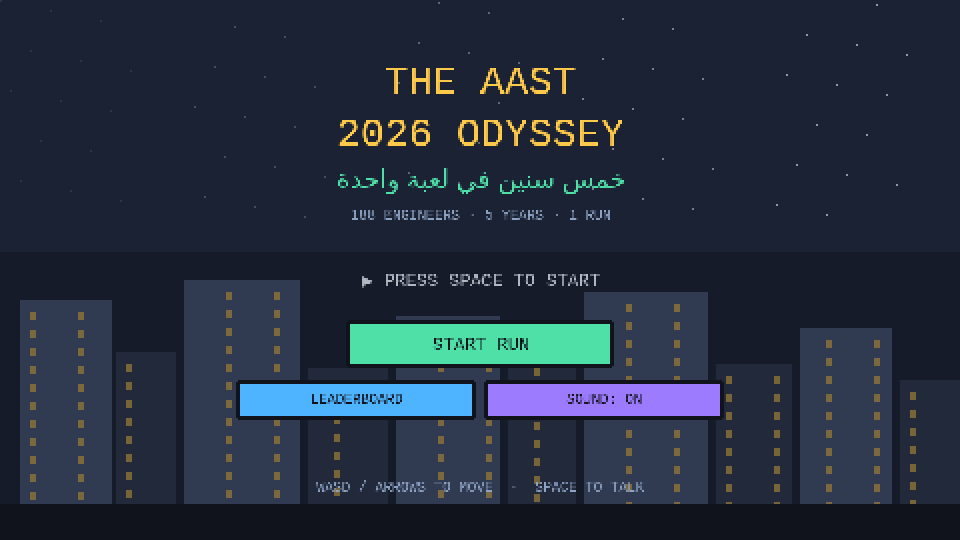
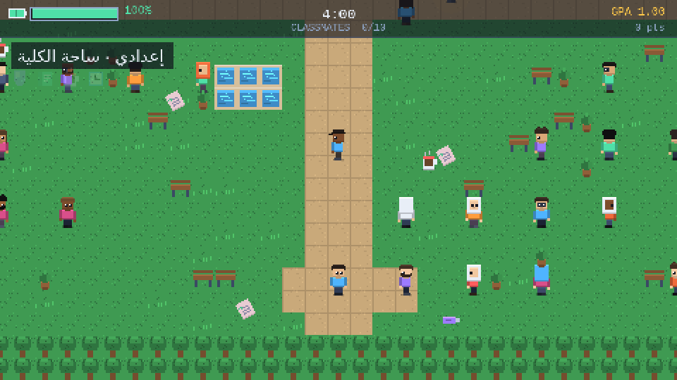
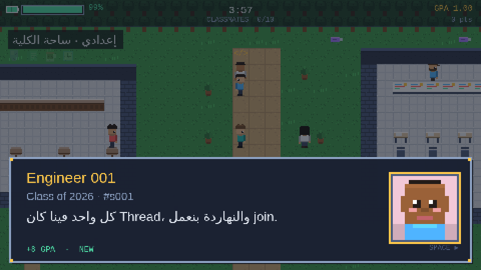
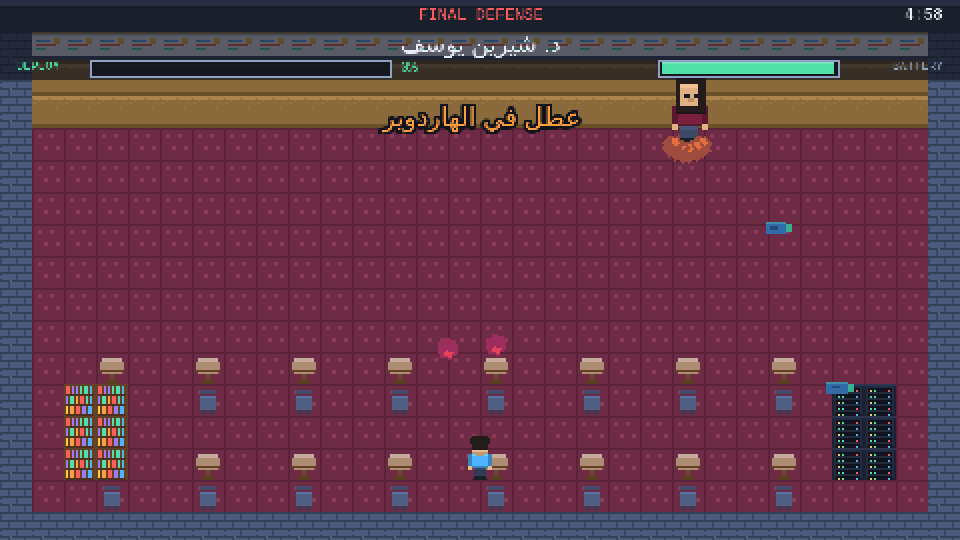
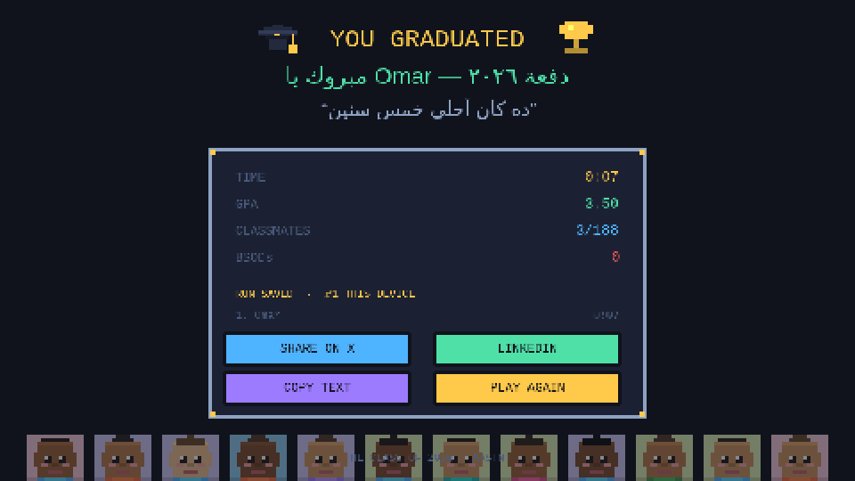

# The AAST 2026 Odyssey

A top-down pixel-art RPG about five years of Computer Engineering at AASTMT,
starring the whole graduating class. You start at the gate in prep year, cross
the courtyard, get lost in Building G, survive the hardware labs, burn out in
Teues and Cilantro, and finish by defending your graduation project.



| | |
|---|---|
|  |  |
|  |  |

## Quick start

```bash
cd game
npm install
npm run dev          # http://localhost:5173
```

Build and check it:

```bash
npm run build        # validates every map, then bundles into dist/
npm run preview      # serve the production build on :4173
npm test             # validates every map (fast, no browser needed)
```

There is also a browser test suite that boots the built game in Chromium, plays
through all five years, the boss and the credits, and fails on any console
error. It is not installed by default because Playwright downloads a browser:

```bash
npm install -D playwright && npx playwright install chromium
npm run preview &                # the tests need the build being served
npm run test:browser
```

## Put the real photos in

This is the one step still waiting on you. The game currently ships a
placeholder roster of 188 students with generated pixel-art baby portraits, so
it is fully playable — but the names are `Engineer 001` through `Engineer 188`.

Download the Drive folder of baby photos to your machine, then:

```bash
pip install Pillow pillow-heif          # pillow-heif only if there are .HEIC files
python3 scripts/build_students.py --import ~/Downloads/BabyPhotos
```

That script reads every image in the folder, uses the **file name as the
student's name** (`Omar Elsayed.HEIC` becomes `Omar Elsayed`), crops each photo
square, resizes to 64×64, saves it as WebP into `public/students/`, and rewrites
`src/data/students.json`.

So before you run it, rename the files to the names you want to appear in game.

Re-running the import never destroys hand-edits: nicknames, custom quotes and
stage numbers already in `students.json` are matched by name and carried over.

## Editing the content

Everything people will want to change lives in data files, not in game code.

**`src/data/students.json`** — one entry per classmate:

```json
{
  "id": "s001",
  "full_name": "Omar Elsayed",
  "nickname": "3amo0r",
  "baby_photo_url": "students/omar-elsayed.webp",
  "stage": 1,
  "custom_quote": "لو الكود اشتغل من أول مرة، يبقى فيه حاجة غلط أكيد."
}
```

`stage` is which year (1–5) they stand in. The import script spreads everyone
evenly; move people around freely.

**`src/data/game_config.json`** — years, time limits, how many classmates you
must greet before the exit opens, hazard counts, the professors and what each
one gives you, the boss, the palette, and the share text.

**`scripts/build_students.py`** — the `QUOTES` list near the top is the pool of
lines assigned to anyone without a custom quote. Add your own inside jokes.

**`src/data/maps.js`** — the five campus maps. They are painted with a small
set of primitives (`room`, `hline`, `scatter`, `furnitureRow`, `mark`) rather
than hand-aligned ASCII, so a miscounted character cannot produce a broken
level. After editing, `npm run validate` walks each map from the spawn tile and
fails if the exit, a professor or a café ends up walled off.

## How it plays

| | |
|---|---|
| Move | `WASD` / arrow keys, or the on-screen stick on a phone |
| Talk | `Space` or `E`, or the `A` button on a phone |
| Mute | `M` |

Your health bar is your **laptop battery**: it drains slowly, faster when a
flying sheet or a surprise quiz hits you, and recharges from coffee and from
standing in a safe zone. Your score is your **GPA**, which goes up when you
greet a classmate for the first time, grab a flash drive, or pick up a solved
sheet.

Each year opens its exit once you have greeted enough classmates. Professors
hand out the power-ups you need for the final defense: an extension from
Dr. Allam, a bug shield from Dr. Moataz Amer, the Clean Code manual from
Dr. Mazen El-Agamy (which doubles every commit in the boss fight), and a full
recharge from Eng. Doweib and Eng. Reham.

Run out of battery or out of time and you get a blue screen. It is a retry, not
a reset: you keep your GPA, your classmates and your gear.

## How it is built

Vite and Phaser 3. The notable part is that **the game ships no art or audio
files at all**:

- `src/core/PixelArt.js` draws every tile, character, item and portrait with
  `fillRect` at start-up and hands the canvases straight to Phaser. All 188
  classmates get a distinct look derived from a hash of their name, so the
  same person always appears the same way.
- `src/core/AudioEngine.js` is a small tracker over the Web Audio API. Seven
  themes and every sound effect are synthesized live.

The whole bundle is about 340 KB gzipped, nearly all of it Phaser, and it loads
in about a second on a phone.

Portraits fall back to a generated pixel baby when a student has no photo yet,
which is why the dialogue box looks finished before the import has been run.

```
src/
  core/        PixelArt, AudioEngine, GameState, MapBuilder, Leaderboard, Joystick, Ui
  data/        students.json, game_config.json, maps.js
  scenes/      Boot, Title, Setup, Terminal, Level, UI, Dialogue, Boss, BSOD, Credits
scripts/
  build_students.py    photo import / roster generation
  validate-maps.mjs    reachability check, runs as part of the build
  smoke.mjs            boots the built game in Chromium and plays it
  progression.mjs      drives a whole run: 5 years, boss, credits, replay
```

## Phones

The game is 16:9 and landscape-only, so a portrait phone gets a "rotate your
phone" screen with a **Play anyway** escape hatch for anyone whose orientation
is locked. In landscape there is a translucent thumb stick on the left, an `A`
button on the right, and a fullscreen button in the corner.

## Deploying

The build has no server side, so any static host works. `vite.config.js` uses a
relative `base`, so it also runs from a plain folder or a subpath.

**Vercel** — import the repo, set **Root Directory** to `game`. The framework
preset for Vite fills in `npm run build` and `dist` automatically.

**GitHub Pages** — `npm run build`, then publish `game/dist`.

## Leaderboard

Out of the box the speedrun board is per-device, kept in `localStorage`. It
works offline, which matters at a party with bad wifi.

To make it shared, create a Supabase project, run this SQL:

```sql
create table public.runs (
  id       bigint generated always as identity primary key,
  name     text    not null check (char_length(name) between 1 and 24),
  time_ms  integer not null check (time_ms > 0),
  gpa      real    not null default 0,
  met      integer not null default 0,
  created  timestamptz not null default now()
);

alter table public.runs enable row level security;
create policy "anyone can read runs"   on public.runs for select using (true);
create policy "anyone can add a run"   on public.runs for insert with check (true);
```

then add a `game/.env` file:

```
VITE_SUPABASE_URL=https://xxxxxxxx.supabase.co
VITE_SUPABASE_ANON_KEY=eyJ...
```

The game syncs automatically when those are present and falls back to the local
board if the network is down. Note that these policies let anyone post a score;
that is the right trade for a class party, not for anything that matters.

## Still to do

- **Real names and photos.** Run the import above.
- **Personal quotes.** Every student currently gets a line from the shared joke
  pool. Filling in `custom_quote` per person is what will make people screenshot
  this.
- **Nicknames.** Optional, shown under the name in the dialogue box.
